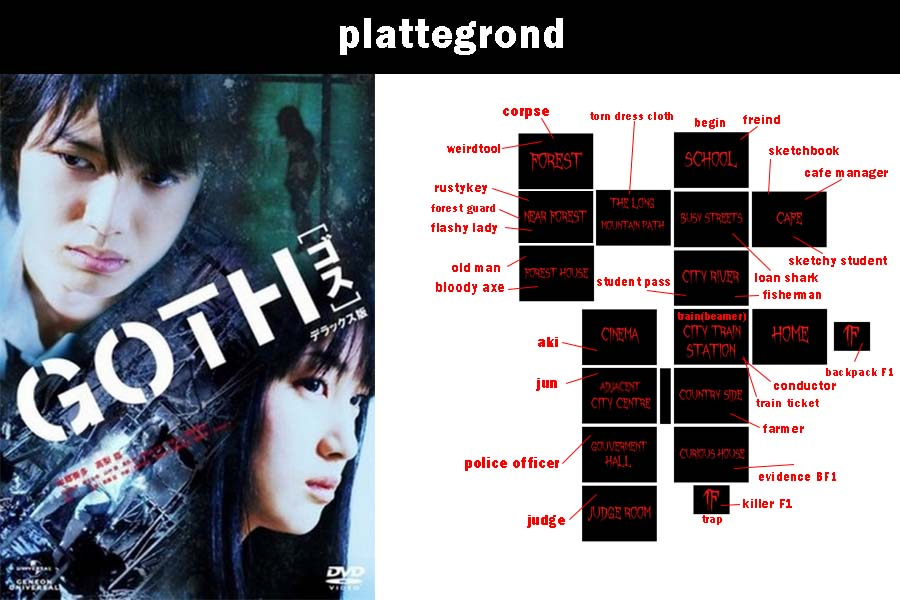
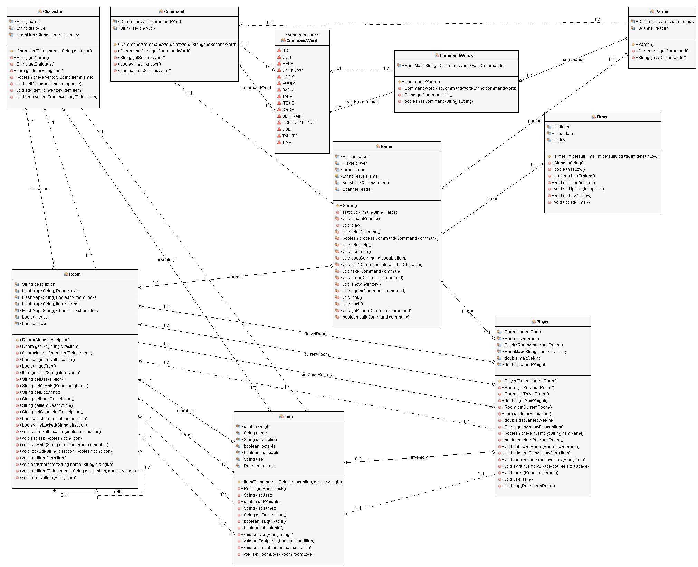

# Jave-GOTH-game
Text-based game inspired by World of Zuul

Naam van het project: GOTH
 
Doel van het project: World of Zuul Hybride
 
Ontwerpers: Adra Philipse
 
Versie of datum: 21-11-2017
 
Hoe je dit project kunt starten: Download de .zip, pak het uit en laad het in BlueJ
 
Gebruiksaanwijzing:
 

go 		-up
		-down
		-north
		-south
		-east
		-west
 
back		(Goes back to previous room)
 
quit		(Quits the game)
 
help		(Show all commands)
 
look		(Prints the location again)
 
equip        	<itemname>  (equip used for backpack)
 
take          	<itemname> (take item from room)
 
drop         	<itemname> (drops item in current room)
 
travel		(travel to location set by settrain)
 
settrain   	(beamer, set train to location)
 
use            	<itemname> (use in a room with an event)
 
talkto        	<charactername> (talk to character)
 
time          	(show the time remaining)

Map

Klassendiagram

